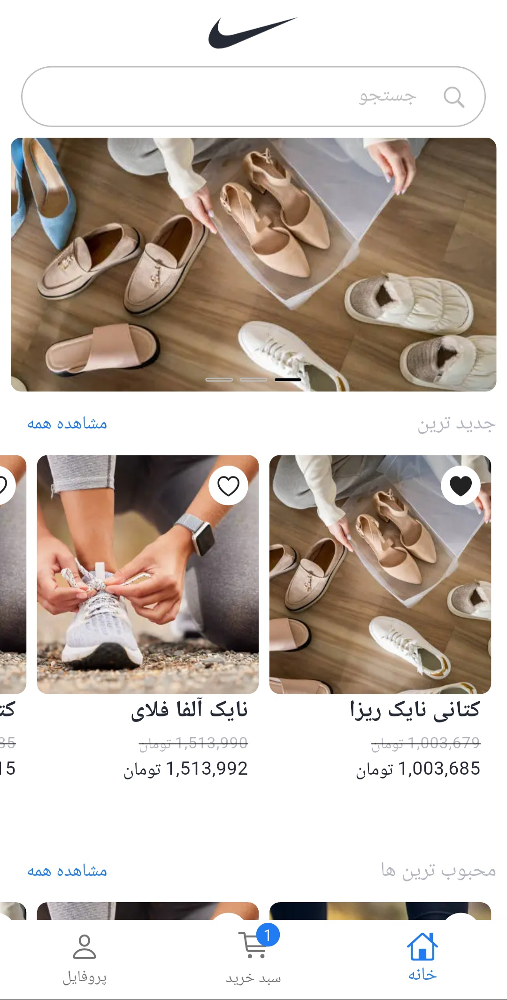
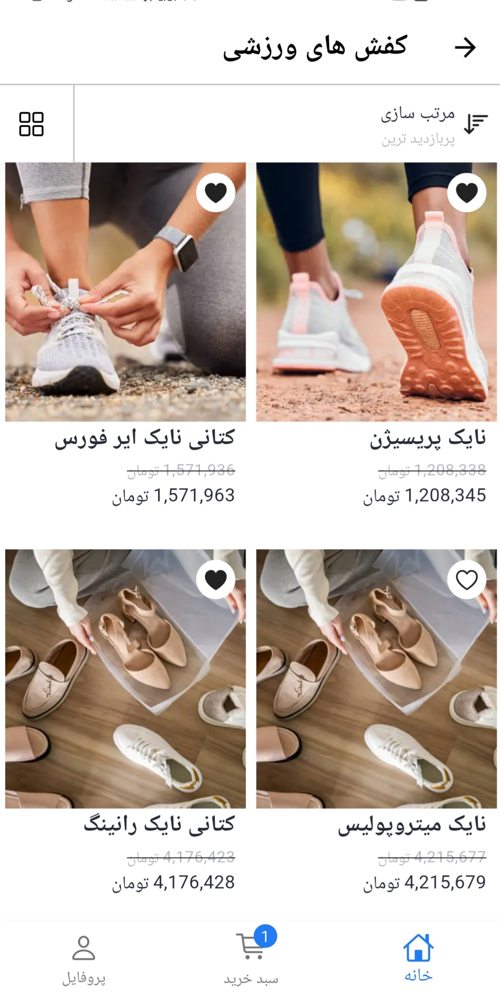
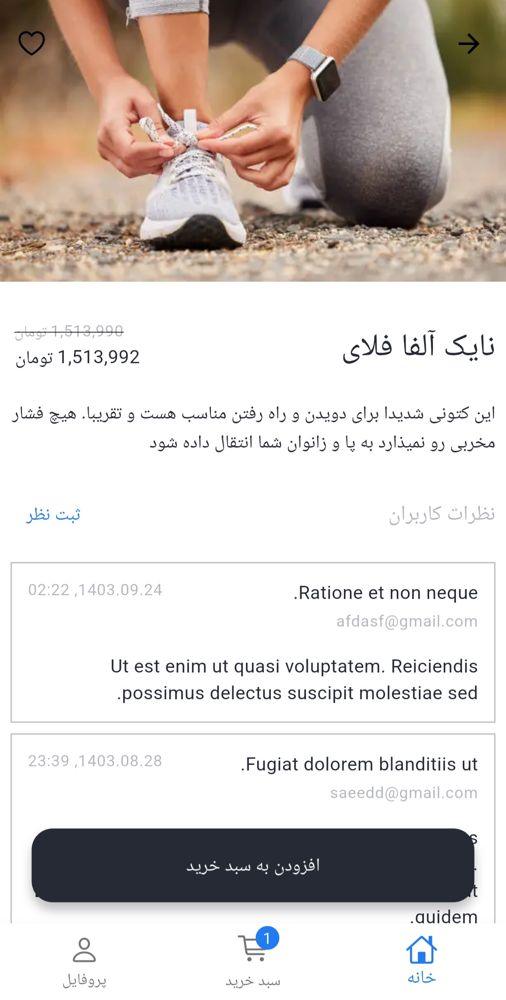
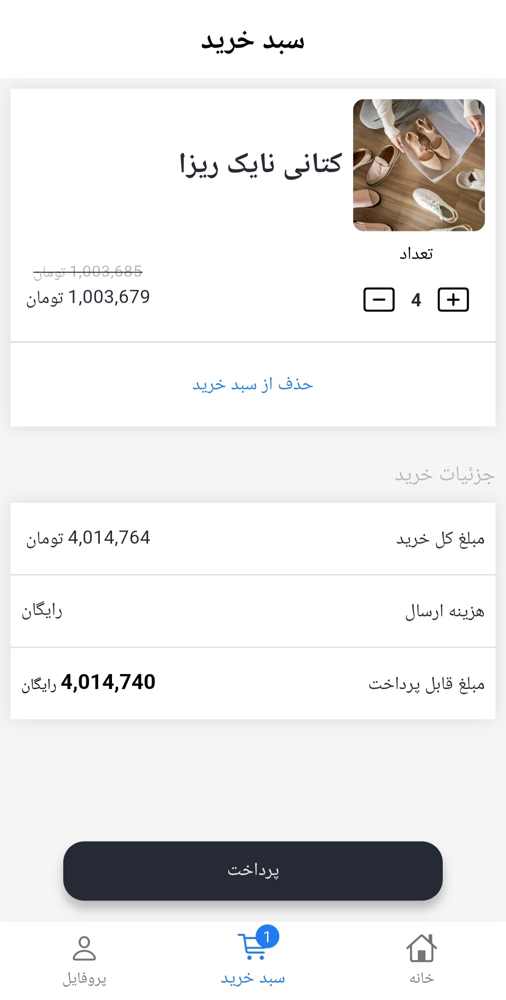
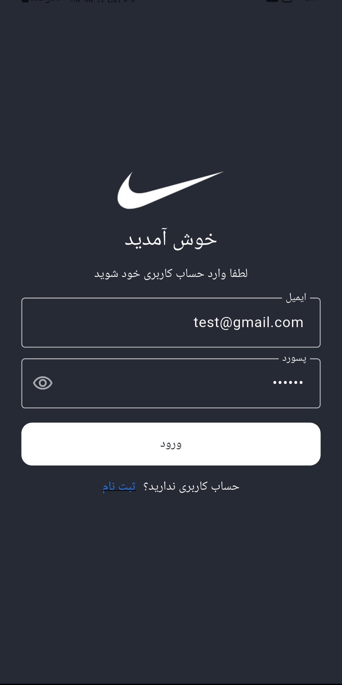
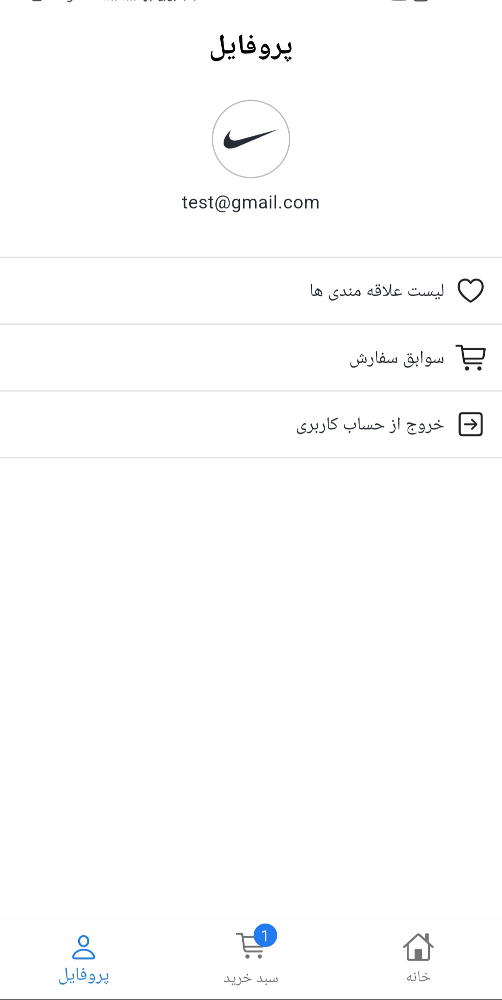

# 👟 Nike E-Commerce App

یک اپلیکیشن فروشگاهی مدرن با الهام از **Nike** که با Flutter توسعه داده شده است.

این پروژه با تمرکز بر **معماری لایه‌ای، مدیریت State با BLoC، ارتباط با REST API و تجربه کاربری یک فروشگاه اینترنتی** طراحی و پیاده‌سازی شده است.

---

## 📱 تصاویر پروژه

<p align="center">
  
  
  
</p>

<p align="center">
  
  
  
</p>

---

## ✨ امکانات

- 🔐 ورود و ثبت‌نام کاربران
- 🏠 صفحه اصلی و نمایش محصولات
- 🔎 مشاهده جزئیات محصول
- 🛒 مدیریت سبد خرید و تغییر تعداد محصولات
- ❤️ سیستم علاقه‌مندی‌ها
- 💬 ثبت و مشاهده نظرات
- 📦 تاریخچه سفارشات
- 💳 پرداخت آنلاین
- 👤 مدیریت حساب کاربری

---

## 🛠️ تکنولوژی‌ها

- **Flutter & Dart**
- **BLoC** — مدیریت State
- **Dio** — ارتباط با API
- **REST API** — دریافت و ارسال اطلاعات
- **WebView** — پرداخت آنلاین
- **JSON Serialization** — تبدیل داده‌های API

---

## 🏗️ معماری پروژه

ساختار پروژه به صورت **Feature-Based** و با تفکیک لایه‌های مختلف طراحی شده است.

```text
lib/
├── common/
├── data/
│   ├── repo/
│   └── source/
├── ui/
│   ├── auth/
│   ├── home/
│   ├── product/
│   ├── cart/
│   ├── favorite/
│   ├── order/
│   ├── shipping/
│   └── receipt/
├── main.dart
└── theme.dart
```

در این ساختار، مسئولیت‌های **Data Source، Repository، Model و UI** از یکدیگر جدا شده‌اند تا پروژه قابل توسعه و نگهداری باشد.

---

## 🔄 مدیریت State

برای مدیریت وضعیت بخش‌های مختلف برنامه از **BLoC** استفاده شده است.

هر Feature در صورت نیاز BLoC مخصوص خود را دارد و وضعیت‌هایی مانند:

- Loading
- Success
- Error
- Empty
- Authentication

به صورت جداگانه مدیریت می‌شوند.

---

## 🚀 اجرا

ابتدا وابستگی‌های پروژه را دریافت کنید:

```bash
flutter pub get
```

سپس برنامه را اجرا کنید:

```bash
flutter run
```

---

## 🎯 هدف پروژه

هدف این پروژه، پیاده‌سازی یک فروشگاه اینترنتی واقعی و تمرین مفاهیم مهم توسعه اپلیکیشن با Flutter بوده است.

مفاهیم اصلی استفاده‌شده در پروژه:

**Flutter → BLoC → REST API → Authentication → Cart Management → Payment**

---

### 👨‍💻 ساخته شده با ❤️ و Flutter
